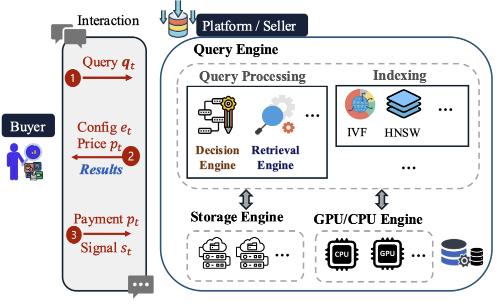

# VTHB: Vector Trading via Hierarchical Bandits


## Features

- **Flexible Data Loader**: Supports FAISS `.fvecs` format and synthetic data.
- **Modular Design**: Experiment logic is divided into configuration selection, pricing strategy, demand modeling, vector database, and experimental runner.
- **Multiple Baselines**: Includes UCB, random, fixed, linear/convex fitting for both configuration and pricing.
- **Extensible**: Easily add new selection strategies or data formats.
- **Ready for Real and Synthetic Data**: Use your own or public datasets.

---

## Directory Structure

```
.
├── dataset/
│   └── data_loader.py          # Data loading utilities (incl. read_fvecs)
├── experiment/
│   ├── config.py               # Experiment configuration dataclass
│   ├── demand.py               # Deterministic demand functions
│   ├── vectordb.py             # Vector database 
│   ├── config_selectors.py     # Retrieval configuration algorithms
│   ├── pricing_strategies.py   # Pricing strategies
│   ├── trading_method.py       # Method composition (config + pricing)
│   └── experiment_runner.py    # Experiment orchestration
├── main.py                     # Entry point of this project
└── README.md                   # Project documentation
```


---

## Quick Start

### 1. Clone this repository

```bash
git clone https://github.com/yourusername/VTHB.git
cd VTHB
```
### 2. Install dependencies

We recommend using `conda` or `venv`:

```bash
pip install -r requirements.txt
```

**Main dependencies:**

- `numpy`
- `hnswlib`
- `scikit-learn`
- `matplotlib`
- `pandas`
- `scipy`

### 3. Prepare data


Due to file size limitations, benchmark datasets are not included in this repository.  
However, you can download the corresponding `.fvecs` files from the official sources below and place them under the `dataset/` directory.

### Download Links

- GIST / SIFT: [http://corpus-texmex.irisa.fr/](http://corpus-texmex.irisa.fr/)
- MSONG: [https://labrosa.ee.columbia.edu/millionsong/](https://labrosa.ee.columbia.edu/millionsong/)
- GloVe: [https://nlp.stanford.edu/projects/glove/](https://nlp.stanford.edu/projects/glove/)

Once downloaded, please rename the files as follows and place them in the `dataset/` folder:

```
dataset/
├── base.fvecs     # Vector database (1M entries)
└── query.fvecs    # Query vectors (e.g., 10K entries)
```


### 4. Run the experiment

Specify data file paths or use default settings in `main.py`:

```python
config = ExperimentConfig()
data, queries = load_data(config, './dataset/base.fvecs', './dataset/query.fvecs')
runner = ExperimentRunner(config, data=data, query=queries)
results = runner.run_comparison_experiment(T=10000, demand_type='bimodal')
print(results)
```

Then run the main script:

```bash
python main.py
```
---

## Integration with Existing Systems

The architecture of VTHB is designed to reflect real-world vector data marketplaces and AI-powered retrieval databse systems, as illustrated below:



In this system, a **buyer** submits a query to a **platform (seller)**. The platform’s **Query Engine** includes:

- A **Decision Engine** that dynamically selects a retrieval configuration (e.g., ANN search parameters) and assigns a price.
- A **Retrieval Engine** that executes the query using indexing structures such as HNSW or IVF.
- And underlying **Storage** and **Compute Engines** (e.g., GPU/CPU) that provide scalable infrastructure.

After receiving results, the buyer provides payment and a feedback signal (e.g., satisfaction score), which is used by the platform to improve future configuration and pricing decisions.

### How VTHB integrates into real-world vector database systems

VTHB can be integrated as a **learning-based control layer** on top of existing vector database frameworks such as:

- **FAISS / Milvus / Weaviate**: VTHB can determine optimal ANN parameters (e.g., `ef`) for each query, enhancing both efficiency and quality.
- **Cloud services (e.g., Pinecone, Qdrant)**: The pricing strategies in VTHB can assign query-time or subscription-based prices based on expected value and cost.
- **Custom engines**: The modular retrieval and pricing logic (see TradingMethod) can be encapsulated in a wrapper that interfaces with existing vector search APIs, enabling adaptive configuration and pricing with minimal code changes. A typical usage is shown below:
```
# vthb_wrapper.py

from experiment.trading_method import TradingMethod
from experiment.config import ExperimentConfig
import numpy as np
from typing import List, Callable

class VTHBWrapper:
    def __init__(
        self,
        config: ExperimentConfig,
        vector_search_fn: Callable[[np.ndarray, int, int], List[int]],
        reward_fn: Callable[[List[int]], float]
    ):
        """
        :param config: ExperimentConfig object
        :param vector_search_fn: a function that takes (query, ef, nprobe) and returns search results
        :param reward_fn: a function that takes search results and returns a reward score
        """
        self.config = config
        self.search_fn = vector_search_fn
        self.reward_fn = reward_fn
        self.trading_method = TradingMethod(config)

    def search(self, query: np.ndarray, feedback: float = 1.0) -> List[int]:
        """
        Performs search with adaptive config and pricing strategy.
        :param query: the query vector
        :param feedback: buyer satisfaction signal from previous interaction (default 1.0)
        :return: search results (list of indices)
        """
        # 1. Select configuration and price
        config_params, price = self.trading_method.select(query, feedback)

        # 2. Call custom backend with selected config
        results = self.search_fn(query, config_params.ef, config_params.nprobe)

        # 3. Compute reward (e.g., buyer satisfaction or matching accuracy)
        reward = self.reward_fn(results)

        # 4. Update the model
        self.trading_method.update(query, config_params, price, reward)

        return results

```

## Datasets

All datasets used in the experiments are **publicly available**:

- **GLOVE1.2M**  
  Source: [Stanford NLP](https://nlp.stanford.edu/projects/glove/)  
  License: *Apache License 2.0* [Pennington et al., 2014]

- **MSONG**  
  Source: [UCI / Columbia University](https://labrosa.ee.columbia.edu/millionsong/)  
  License: *Creative Commons Attribution 4.0 (CC BY 4.0)* [Bertin-Mahieux et al., 2011]

- **SIFT1M**  
  Source: [BIGANN collection](http://corpus-texmex.irisa.fr/)  
  License: Publicly accessible. No explicit license in the original release.

- **GIST1M**  
  Source: [BIGANN collection](http://corpus-texmex.irisa.fr/)  
  License: Publicly accessible. No explicit license in the original release.

⚠️ *Note: For SIFT1M and GIST1M, the original distribution does not specify license terms explicitly. They are widely used for academic purposes.*

## License

This project is licensed under the MIT License. See the [LICENSE](./LICENSE) file for details.
