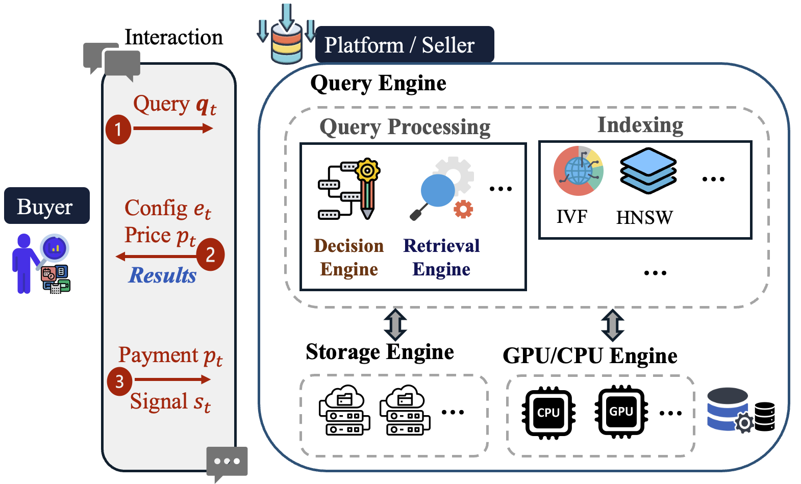

# VTHB: Vector Trading via Hierarchical Bandits

---
This repository provides a modular and extensible experimental framework for joint retrieval configuration and dynamic pricing strategy in vector data markets, as described in our paper.
---

## Features

- **Flexible Data Loader**: Supports FAISS `.fvecs` format and synthetic data.
- **Modular Design**: Experiment logic is divided into configuration selection, pricing strategy, demand modeling, vector database, and experimental runner.
- **Multiple Baselines**: Includes UCB, random, fixed, linear/convex fitting for both configuration and pricing.
- **Extensible**: Easily add new selection strategies or data formats.
- **Ready for Real and Synthetic Data**: Use your own or public datasets.

---

## Directory Structure

```
.
├── dataset/
│   └── data_loader.py          # Data loading utilities (incl. read_fvecs)
├── experiment/
│   ├── config.py               # Experiment configuration dataclass
│   ├── demand.py               # Deterministic demand functions
│   ├── vectordb.py             # Vector database (HNSW, FAISS-style interface)
│   ├── config_selectors.py     # Retrieval configuration algorithms
│   ├── pricing_strategies.py   # Pricing strategies
│   ├── trading_method.py       # Method composition (config + pricing)
│   └── experiment_runner.py    # Experiment orchestration
├── main.py                     # Entry point for running experiments
└── README.md                   # Project documentation
```


---

## Quick Start

### 1. Clone this repository

```bash
git clone https://github.com/yourusername/VTHB.git
cd VTHB
```
### 2. Install dependencies

We recommend using `conda` or `venv`:

```bash
pip install -r requirements.txt
```

**Main dependencies:**

- `numpy`
- `hnswlib`
- `scikit-learn`
- `matplotlib`
- `pandas`
- `scipy`

### 3. Prepare data


Due to file size limitations, benchmark datasets are not included in this repository.  
However, you can download the corresponding `.fvecs` files from the official sources below and place them under the `dataset/` directory.

### Download Links

- GIST / SIFT: [http://corpus-texmex.irisa.fr/](http://corpus-texmex.irisa.fr/)
- MSONG: [https://labrosa.ee.columbia.edu/millionsong/](https://labrosa.ee.columbia.edu/millionsong/)
- GloVe: [https://nlp.stanford.edu/projects/glove/](https://nlp.stanford.edu/projects/glove/)

Once downloaded, please rename the files as follows and place them in the `dataset/` folder:

```
dataset/
├── base.fvecs     # Vector database (1M entries)
└── query.fvecs    # Query vectors (e.g., 10K entries)
```


### 4. Run the experiment

Specify data file paths or use default settings in `main.py`:

```python
from dataset.data_loader import load_data
from experiment.config import ExperimentConfig

config = ExperimentConfig()
data, queries = load_data(config, 'dataset/base.fvecs', 'dataset/query.fvecs')

# Continue with experiment logic...
```

Then run the main script:

```bash
python main.py
```
---

## Integration with Existing Systems

The architecture of VTHB is designed to reflect real-world vector data marketplaces and AI-powered retrieval systems, as illustrated below:



In this system, a **buyer** submits a query to a **platform (seller)**. The platform’s **Query Engine** includes:

- A **Decision Engine** that dynamically selects a retrieval configuration (e.g., ANN search parameters) and assigns a price,
- A **Retrieval Engine** that executes the query using a vector index such as HNSW or IVF,
- And underlying **Storage** and **Compute Engines** (e.g., GPU/CPU) that provide scalable infrastructure.

After receiving results, the buyer provides payment and a feedback signal (e.g., satisfaction score), which is used by the platform to improve future configuration and pricing decisions.

### How VTHB integrates into real-world vector database systems

VTHB can be integrated as a **learning-based control layer** on top of existing vector database frameworks such as:

- **FAISS / Milvus / Weaviate**: VTHB can determine optimal ANN parameters (e.g., `ef`, `nprobe`) for each query, enhancing both efficiency and quality.
- **Cloud services (e.g., Pinecone, Qdrant)**: The pricing strategies in VTHB can assign query-time or subscription-based prices based on expected value and cost.
- **Custom engines**: The modular retrieval and pricing logic (see `TradingMethod`) can wrap around existing retrieval APIs to provide adaptive behavior with minimal modification.

In short, VTHB enables **value-aware, adaptive vector search and pricing**, and is suitable for integration into production-grade systems that require intelligent control over ANN configurations and data monetization policies.


## License

This project is licensed under the MIT License. See the [LICENSE](./LICENSE) file for details.
